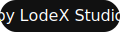

# Lodex Studio Cards


---


---

## � Overview

**Lodex Studio Cards** is a visually striking collection of 6 interactive card UI components for React, designed for modern web projects. Each card demonstrates a unique animation or interaction, perfect for portfolios, landing pages, and creative showcases.

---

## �🃏 Demo Grid

> See all cards in action:


---

## ✨ Card Components

- [Tilt Shine Card](https://github.com/lodsa-ntos/tilt-shine-card) — 3D tilt and shine effect
- [Swipe Cards](https://github.com/lodsa-ntos/swipe-cards) — Tinder-style swipeable cards
- [Shimmer Border Card](https://github.com/lodsa-ntos/shimmer-border-card) — Animated shimmer border
- [Drag Cards](https://github.com/lodsa-ntos/drag-cards) — Draggable floating cards
- [Outline Cards](https://github.com/lodsa-ntos/outline-cards) — Minimal outline hover cards
- [Color Change Cards](https://github.com/lodsa-ntos/color-change-cards) — Colorful hover transitions

---

## 🚀 Features

- 6 unique, production-ready card components
- Modern React + Tailwind CSS
- Fully responsive and accessible
- Easy to customize and extend
- MIT licensed, open source

---

## 🏁 Quick Start

```bash
git clone https://github.com/lodsa-ntos/lodexstudio-cards.git
cd lodexstudio-cards
npm install
npm run dev
```

Open [http://localhost:5173](http://localhost:5173) to view the demo grid.

---

## 🛠️ Usage

Import any card component into your project:

```jsx
import TiltShineCard from './components/cards/TiltShineCard';

function MyPage() {
 return <TiltShineCard />;
}
```

---

## 🤝 Contributing

Contributions, issues, and feature requests are welcome! Feel free to open an issue or submit a pull request.

---

## 🏷️ By LodeX Studio



---

## 📄 License

MIT — free for personal and commercial use.
