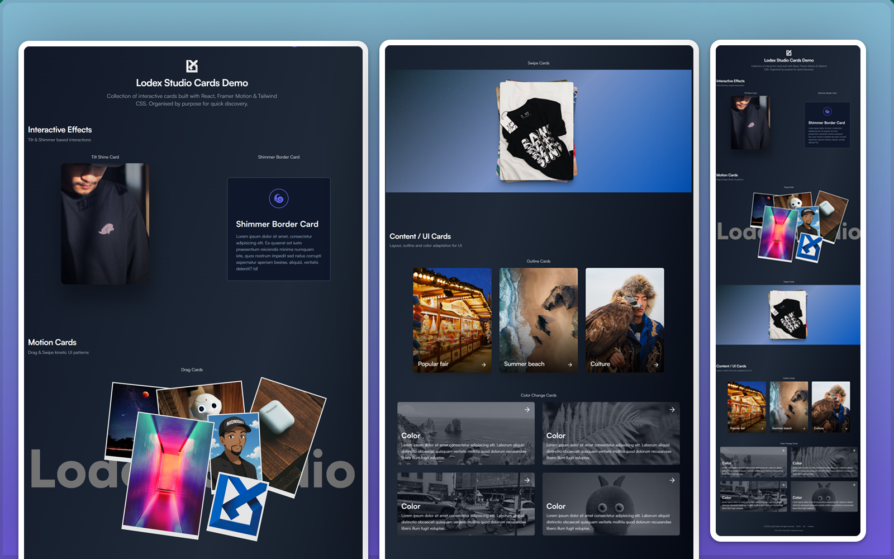

# <h1 align="center"> Lodex Studio Cards </h1>

---

<p align="center">
  <a href="#"></a>
  <a href="#"></a>
  <a href="#"></a>
  <a href="#"></a>
</p>

> See all cards in action:
<p align="center">
  
</p>

👉 [Live Demo](https://lodexstudio-cards.vercel.app) | [Docs](#) | [Report Bug](https://github.com/lodsa-ntos/lodexstudio-cards/issues)

---

## � Overview

**Lodex Studio Cards** is a collection of 6 interactive components for React, focusing on **motion, micro-interactions, and modern UI**. Ideal for **portfolios, landing pages, and creative showcases**.

---

## 🎥 Preview

<p align="center">
  
  
   
</p>

---

## 🎨 Card Components

- [Tilt Shine Card](https://github.com/lodsa-ntos/tilt-shine-card) — 3D tilt and shine effect
- [Swipe Cards](https://github.com/lodsa-ntos/swipe-cards) — Tinder-style swipeable cards
- [Shimmer Border Card](https://github.com/lodsa-ntos/shimmer-border-card) — Animated shimmer border
- [Drag Cards](https://github.com/lodsa-ntos/drag-cards) — Draggable floating cards
- [Outline Cards](https://github.com/lodsa-ntos/outline-cards) — Minimal outline hover cards
- [Color Change Cards](https://github.com/lodsa-ntos/color-change-cards) — Colorful hover transitions

---

## ⚡ Features

- ✅ 6 unique components ready for production
- ✅ Made with React + Tailwind CSS + Framer Motion
- ✅ Fully responsive and accessible
- ✅ Simple customisation (plug & play)
- ✅ MIT — free for personal and commercial use

---

## 🚀 Quick Start

```bash
git clone https://github.com/lodsa-ntos/lodexstudio-cards.git
cd lodexstudio-cards
npm install
npm run dev
```

Open [Lodex Studio Cards](https://lodexstudio-cards.vercel.app/) to view the demo grid.

---

## 📦 Installation

```bash
# via npm
npm install lodexstudio-cards

# via yarn
yarn add lodexstudio-cards

# via pnpm
pnpm add lodexstudio-cards
```

---

## 💻 Usage

Import any card component into your project:

```jsx
import { TiltShineCard } from "lodexstudio-cards";

export default function App() {
  return <TiltShineCard />;
}
```

---

## 🤝 Contributing

Contributions, issues, and feature requests are welcome! Feel free to open an issue or submit a pull request.

---

## 📜 License

Distributed under the MIT License. See [LICENSE](./LICENSE) for details.

---

<p align="center">
  ⭐ If this project helped you, leave a star on GitHub!
  Made with ❤️ by <a href="https://lodexstudio.com">Lodex Studio</a>
</p>
